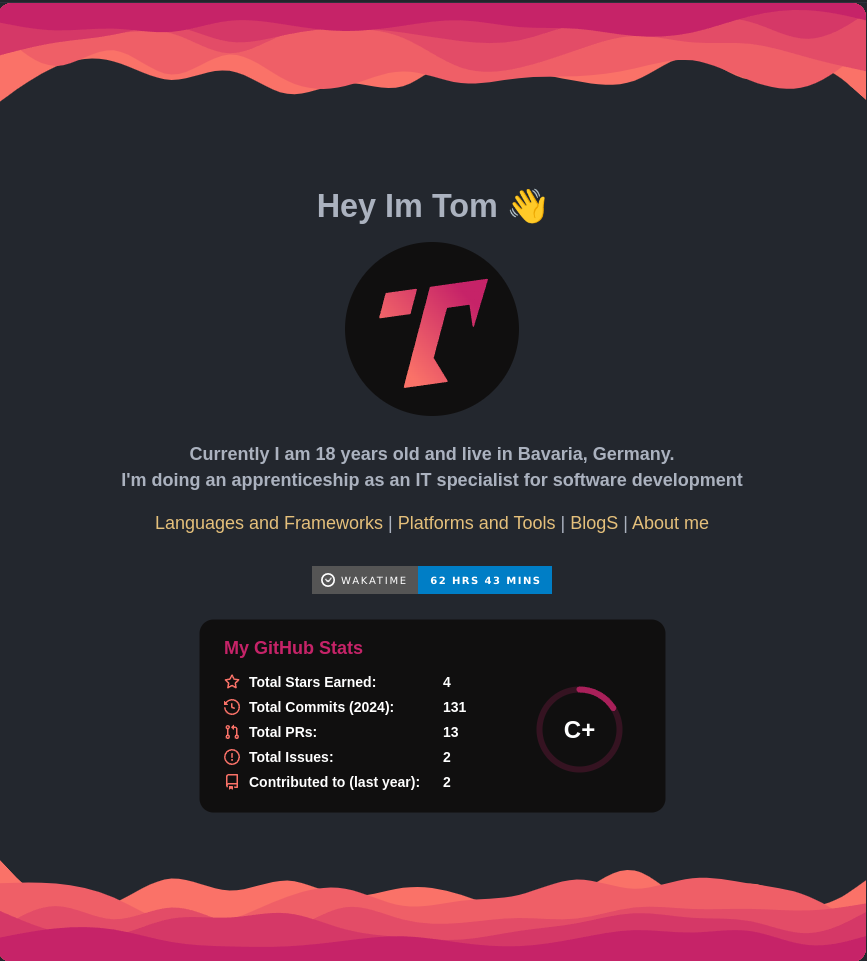

# My New README and Blog
published on 02.02.2024 by Tom Werth

## Introduction
I decided to create a new README and Blog for my GitHub Profile. I wanted to have a more modern and clean look for my profile. I also wanted to have a place where I can write about my projects, my life, and my thoughts. I will also write about my experiences with new technologies and my journey as a developer.

---

### README
My new Readme is inspired by the **[Asedem](https://github.com/Asedem)**
I find the **multi-page** layout very appealing and I wanted to have something similar for my profile.

I also updated my Profile Picture and added some Badges to it. I also added a **WakaTime** Badge to show my coding activity.

I decided to split the **Languages and Frameworks** and **Platforms and Tools** into separate pages to make it more organized.

also I added a **Blog** page where I will write about my projects, my life, and my thoughts. I will also write about my experiences with new technologies and my journey as a developer.

I also added a **About me** page where I will write about myself and my journey as a developer.

---

### Blog

I will write about my projects, my life, and my thoughts. I will also write about my experiences with new technologies and my journey as a developer.

but I will **not** post **regularly**, only when I have something to share.

---

## Conclusion
I'm very happy with my new README and Blog and I hope you like it too.

---

## References
- [Asedem](https://github.com/Asedem)
- [WakaTime](https://wakatime.com/)
- [GitHub-Stats](https://github.com/anuraghazra/github-readme-stats)

_last edited: 02.02.2024 at 10:42 by Tom Werth_
